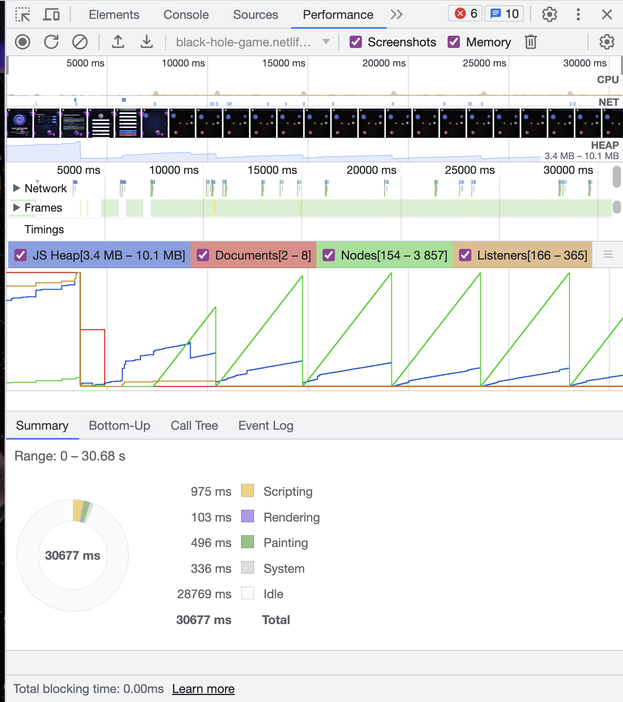

# Утечки памяти в приложении

На данный момент утечек памяти в приложении не обнаружено.

## Используемая методика поиска утечек

- Анализ вкладки "Memory". Использование различных разделов в течение 5 минут и проверка, что потребление памяти основого потока остается постоянным с течением времени (~4 МБ).
- Анализ вкладки "Performance". Прохождение ряда разделов и прохождение игры. Анализ полученного графика говорит о том что потребление памяти остается постоянным.
  Результат анализа вкладки "Performance":
  
- Анализ вкладки "React Profiler" на различных разделах приложения. Проверка, что не происходит затяжных рендеров компонентов.

## Дополнительные действия для устранения потенциальных проблем с памятью.

- Использование линтера, запуск его на pre-commit hook. Он ловит такие вещи, как передача немемоизированной функции в зависимости эффекта.
- Кросс-ревью. Обращаем внимание на такие вещи, как корректное освобождение ресурсов при размонтировании компонентов, а также соблюдение правил линтера.
